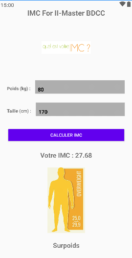
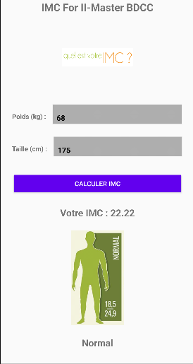

<h1>📱 Calcul IMC</h1>

Une simple application Android qui permet de calculer et d'afficher l'IMC (Indice de Masse Corporelle) 
d'un utilisateur en fonction de son <b>poids</b> et sa <b>hauteur</b> 

 

<h3>🧮 Formule mathématique de l'IMC</h3>

<b>IMC</b> = <b>Poids (Kg)</b> ➗ <b>Taille² (m)</b>

 

<h3>🤖 Technologies utilisées</h3>
<ul>
<li><b>Language de programmation : Java</b></li>
<li><b>Environnement de développement : Android Studio</b></li>
<li><b>Version Sdk min (minSdk) : 24</b></li>
<li><b>Version Sdk max (targetSdk) : 36</b></li>
</ul>

 
<h3>🔍 Description de l'application</h3>

 

1 - L'utilisateur doit saisir son poids et sa taille

2 - L'application valide les données saisies

3 - Si tout passe bien, l'application calcule l'IMC, et affiche : 

<ul>
<li>L'IMC calculé</li>
<li>Une image convenable qui explique très bien la valeur de l'IMC</li>
<li>Un petit texte qui peut être soit : Maigreur, Normal, Surpoids, Obésité ou Obésité modérée selon la valeur de l'IMC</li>
</ul>

 
<h3>Démonstration</h3>

 

 

 

 

 

🖊️ <b>Réalisé par :</b> Iliasse Abdessamad

📚 <b>Sujet :</b> Développement mobile pour la platforme Android

🗓️ <b>Année :</b> 2025 - 2025

